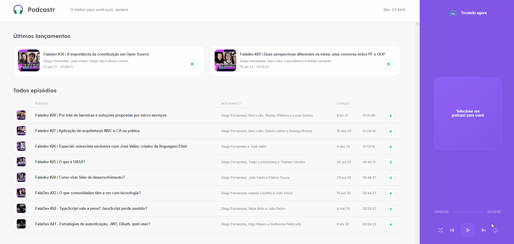

<div align="center">
  
</div>



## 💻 Project proposal

Podcastr is a platform built for podcast broadcasting. Project developed during the 5th edition of the Next Level Week of Rocketseat- ReactJS Trail.

## 🧭 Tecnologies

This project was developed using cutting edge front-end technologies.

- [ReactJS](https://reactjs.org/)
- [Typescript](https://www.typescriptlang.org/)
- [Next.js](https://nextjs.org/)

<h2>
  📌 To have a copy of the project
</h2>

### Clone the repository to have a copy of the code on your machine

```bash
$ git clone https://github.com/DeboraZandonai/Podcastr && cd Podcastr
```

### Load dependencies

```bash
$ yarn install
```

### Run the backend fake server

```bash
$ yarn server
```

### Run the project

```bash
$ yarn dev
```

The app will be available for access on your browser at **http://localhost:3000**

## 📝 Licença

This project is under the **MIT** license. For more information, access the file [LICENSE](https://github.com/DeboraZandonai/Podcastr/blob/master/LICENSE).

<h4 align=center>Made with ❤️ by <a href="https://www.linkedin.com/in/debora-zandonai-4ab092195/">Debora Zandonai</a></h4>
